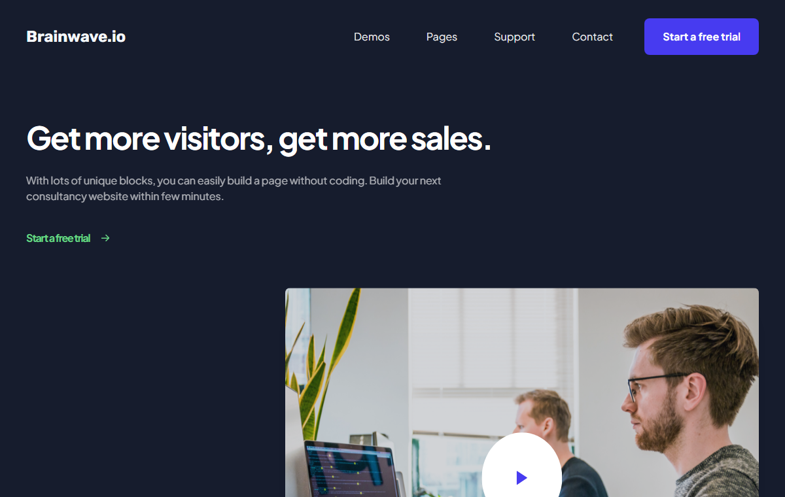
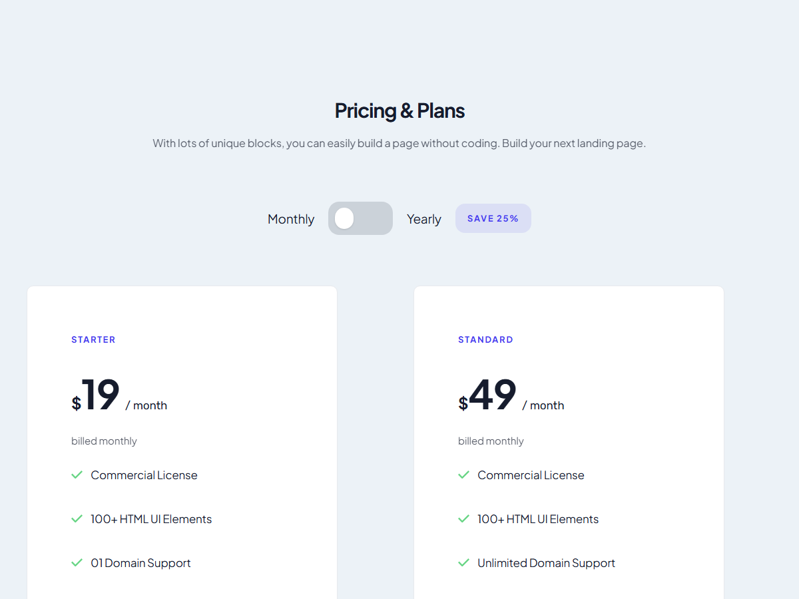
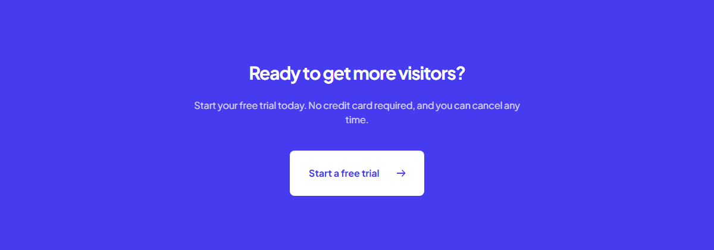
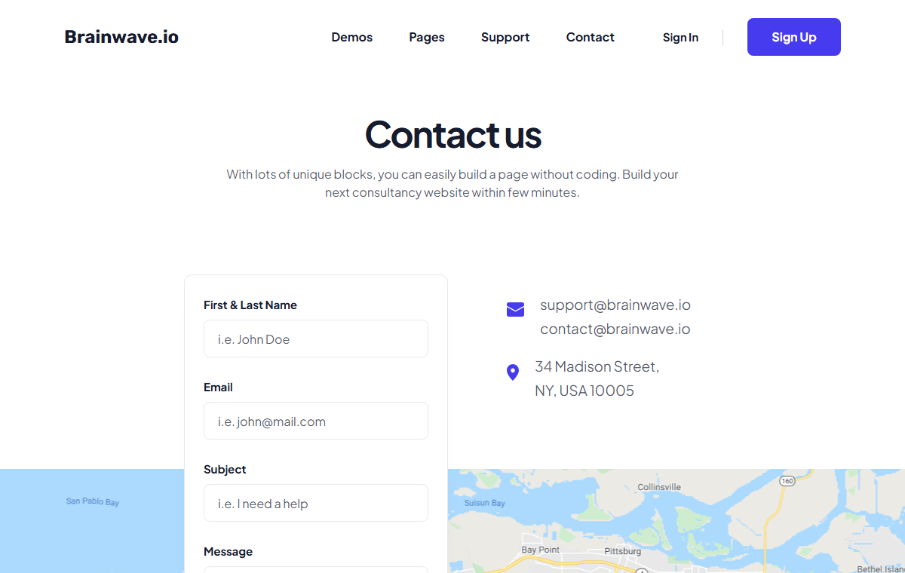
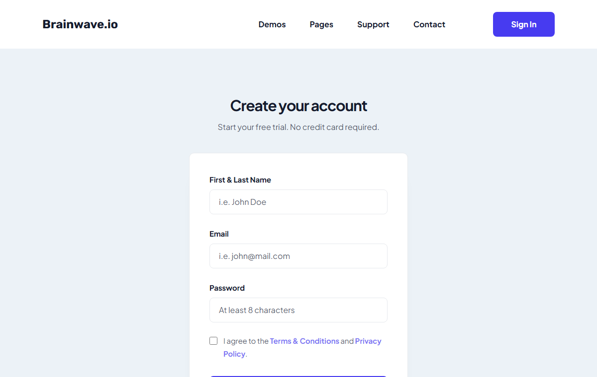
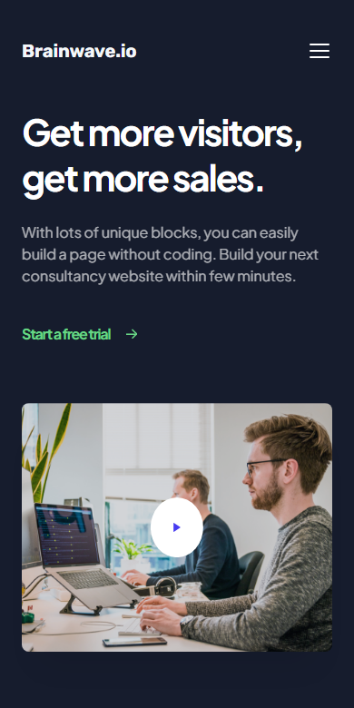
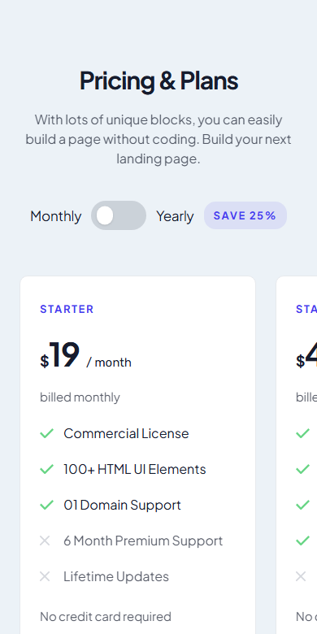

 SaaS Landing Page -Figma to Code

A pixel-faithful React implementation of a Figma landing page design, plus a contact
screen and two auth screens composed from the same design system.

**Stack:** React 19 · TypeScript · Vite 8 · Tailwind CSS v4 · React Router 7

---

## Screenshots



| Pricing & plans | Closing CTA |
|---|---|
|  |  |

| Contact | Sign up |
|---|---|
|  |  |

Mobile — the plans, testimonials and partner logos become snapping horizontal rails
below `md`:

<p>
  
  
</p>

---

## Design source

Figma file — **[Landing Page](https://www.figma.com/design/3OPg8kyaSzA3Dv6VyEjSlg/Landing-Page)**
(`fileKey` `3OPg8kyaSzA3Dv6VyEjSlg`, single page `0:1`).

Every component carries a doc comment naming the node it came from. The map:

| Node | Figma layer | Component |
|---|---|---|
| `1:1577` | Header | [`SiteHeader`](frontend/src/components/layout/SiteHeader.tsx) (`overlay`) |
| `1:1140` | Hero | [`Hero`](frontend/src/components/landing/Hero.tsx) |
| `1:1114` | Logos | [`LogoCloud`](frontend/src/components/landing/LogoCloud.tsx) |
| `1:1091` | Features | [`Features`](frontend/src/components/landing/Features.tsx) |
| `1:1082` | Content 01 | [`ContentTrack`](frontend/src/components/landing/ContentTrack.tsx) |
| `1:1074` | Content 02 | [`ContentVisitors`](frontend/src/components/landing/ContentVisitors.tsx) |
| `1:1064` | Content 03 | [`ContentServices`](frontend/src/components/landing/ContentServices.tsx) |
| `1:1004` | Pricing | [`Pricing`](frontend/src/components/landing/Pricing.tsx) |
| `1:1006` | ↳ Title | via [`Heading`](frontend/src/components/ui/Heading.tsx) |
| `1:1048` | ↳ Full toggle | [`BillingToggle`](frontend/src/components/landing/BillingToggle.tsx) |
| `1:1009` `1:1022` `1:1035` | ↳ Plan cards | [`PricingCard`](frontend/src/components/landing/PricingCard.tsx) |
| `1:1055` | ↳ Testimonial | [`Testimonials`](frontend/src/components/landing/Testimonials.tsx) |
| `1:1003` | Footer | [`SiteFooter`](frontend/src/components/layout/SiteFooter.tsx) |
| `5:1765` | Contact header | `SiteHeader` (`solid`) |
| `5:1771` | Contact hero | [`ContactHero`](frontend/src/components/contact/ContactHero.tsx) |
| `5:1758` | Form | [`ContactForm`](frontend/src/components/contact/ContactForm.tsx) |
| `5:1744` | Info | [`ContactInfo`](frontend/src/components/contact/ContactInfo.tsx) |
| `5:1740` | Map | [`ContactMap`](frontend/src/components/contact/ContactMap.tsx) |

**Not in Figma** — composed from the design system, and marked as such in code: the
sign-in / sign-up screens, the closing
[`CallToAction`](frontend/src/components/landing/CallToAction.tsx) band, the `inverse`
Button variant, and the sub-`lg` mobile navigation.

### Assets

All 56 icons, photos and logos were exported from Figma and committed under
`frontend/src/assets/` (`icons/`, `images/`, `logos/`). Nothing is fetched from Figma
at build or runtime — the MCP asset URLs expire after about 7 days.

Client logos ship as a raster **plus an alpha mask**: Figma stacks a `#7d818d` masked
layer over the artwork to desaturate it, and
[`ClientLogo`](frontend/src/components/ui/ClientLogo.tsx) reproduces both layers.

---

## Getting started

```bash
cd frontend
npm install
npm run dev        # http://localhost:5173
```

| Script | Does |
|---|---|
| `npm run dev` | Vite dev server with React Fast Refresh |
| `npm run build` | `tsc -b` then `vite build` into `frontend/dist` |
| `npm run preview` | Serve the production build locally |
| `npm run lint` | ESLint over the project |

---

## Project structure

```
frontend/src/
├─ assets/            icons/ · images/ · logos/   (exported from Figma)
├─ components/
│  ├─ ui/             Button · Heading · Section · Container · CardRail
│  │                  TextField · Checkbox · PlanFeature · Tag · ArrowRight
│  │                  ClientLogo
│  ├─ sections/       SplitSection          (shared media-beside-copy layout)
│  ├─ layout/         SiteHeader · SiteFooter
│  ├─ landing/        Hero · LogoCloud · Features · Content{Track,Visitors,Services}
│  │                  Pricing · PricingCard · BillingToggle · Testimonials
│  │                  CallToAction · ContentCopy
│  ├─ contact/        ContactHero · ContactForm · ContactInfo · ContactMap
│  └─ auth/           AuthLayout
├─ data/              landing.ts · contact.ts · auth.ts   (all copy lives here)
├─ lib/cn.ts          tailwind-merge wrapper
├─ pages/             LandingPage · ContactPage · SignInPage · SignUpPage
└─ index.css          @theme design tokens
```

Routes: `/` · `/contact` · `/signin` · `/signup`.

---

## Design system

Tokens live in `@theme` in [`index.css`](frontend/src/index.css) — components
reference them rather than hard-coded values.

| | |
|---|---|
| **Colour** | `brand #473bf0` · `ink #161c2d` · `cloud #ecf2f7` · `mist #f4f7fa` · `hairline #e7e9ed` · `logo #7d818d` · `mint #68d585` |
| **Type** | `display 60/65` → `h2 36/48` → `h3 24/34` → `h4 21/32` → `lead 19/32` → `body 17/29` → `small 15/26` → `eyebrow 13` |
| **Radius** | `control 8px` · `card 10px` · `pill 14.5px` |
| **Shadow** | `card` · `soft` · `form` |
| **Container** | `page 1488px` (landing frame) · `narrow 1110px` (contact frame) |

Container width is driven by a `--container-w` variable set on a page's root element,
so header, sections and footer all follow without prop plumbing.

---

## Implementation notes

Decisions a future reader would otherwise have to rediscover:

- **Fonts.** The design uses **Gilroy**, which is commercial and not redistributable.
  The stack is `"Gilroy", "Plus Jakarta Sans", …`, with Plus Jakarta Sans loading from
  Google Fonts as the closest free match. Drop real Gilroy files into
  `src/assets/fonts` and they take over with no code change. Rubik (wordmark,
  `/ month`) is genuine.

- **Two container widths.** The landing artboard is 2144px wide with a 1488px column;
  the contact artboard is 1600px with a 1110px column. Both are honoured.

- **Masked compositions** — the laptop overhanging its card, the overlapping app
  screens, the staggered photo grid — are positioned in percentages against a fixed
  `aspect-ratio`, so they scale exactly as drawn instead of breaking at fixed pixels.

- **`?no-inline` on the laptop mask.** It sits under Vite's 4096-byte inline
  threshold, and as a `data:` URI its `<`, `>` and `#` characters break `url()`
  parsing, silently dropping the whole `mask-image` declaration. Every `url()` value
  is quoted for the same reason.

- **`cn()` uses tailwind-merge.** Tailwind resolves conflicts by stylesheet order, not
  attribute order, so a caller passing `hidden` to a component whose base classes
  include `inline-flex` silently loses. That bug shipped twice before this was added.

- **Avoid `%` and `calc()` inside arbitrary Tailwind class names.** A
  `left-[calc(100%-26.6px)]` class generates valid CSS but never matches the element.
  See [`BillingToggle`](frontend/src/components/landing/BillingToggle.tsx).

- **Yearly pricing is an assumption.** Figma gives monthly figures and a "Save 25%"
  badge but no yearly numbers, so the toggle applies 25% off the monthly rate. Swap in
  real values in [`data/landing.ts`](frontend/src/data/landing.ts).

- **Mobile.** Verified free of horizontal overflow at 320 / 360 / 390 / 414 / 640 /
  768 / 1024 / 1280 / 1440 / 1920 px.

---

## Deployment

Configured for **Netlify** via [`netlify.toml`](netlify.toml) — connect the repo and
leave the build fields blank in the UI; the file supplies them.

| Setting | Value |
|---|---|
| Base directory | `frontend` |
| Build command | `npm run build` |
| Publish directory | `dist` (resolves to `frontend/dist`) |
| Node | 22 |

It also declares an SPA fallback (`/*` to `/index.html`, status 200) — without it
`/contact`, `/signin` and `/signup` return 404 on a direct hit or refresh — and
immutable caching for Vite's fingerprinted `/assets/*`.

---

## Known gaps

- **Forms don't submit.** Contact, sign-in and sign-up all call `preventDefault()` and
  have no endpoint. For the contact form on Netlify, adding `data-netlify="true"` gets
  you Netlify Forms without a backend.
- **Image weight.** `hero-video.png` (1.37 MB) and `map.png` (1.26 MB) ship
  uncompressed — about 2.6 MB, against 96 kB of gzipped JS. WebP would cut roughly 80%.
- **No tests.** No test runner is configured.
- **Auth is presentational** — no validation, state or provider wiring.
